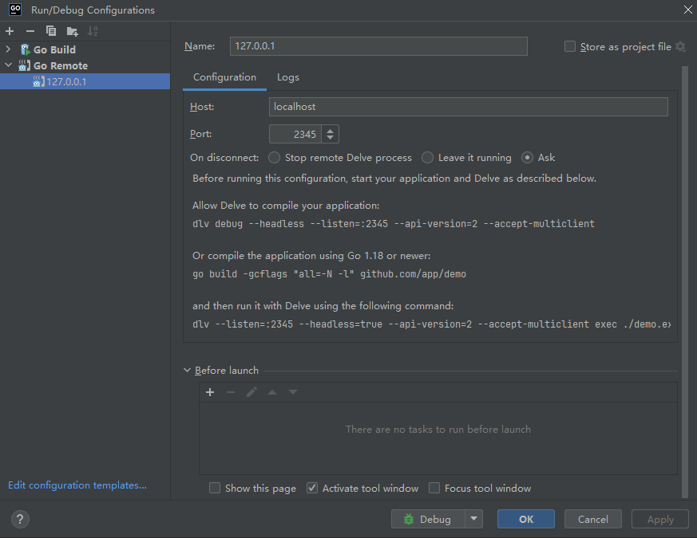

# process_exporter

*ncabatoff/process-exporter 问题排查，拓展*

### 基于 Docker 的本地调试及服务安装

1. **进入 `./cmd` 目录，执行打包脚本启动服务，并生成 `process_exporter.tar.gz` 安装包**
   ```bash
   cd ./cmd
   ./build.cmd

2. **配置调试环境**
    - 打开 **Edit Configurations** 菜单
    - 点击 **Add New Configuration**，选择 **Go Remote**

   

3. **启动 Debug 模式**  
   访问以下地址进行调试：[http://127.0.0.1:9256/metrics](http://127.0.0.1:9256/metrics)

4. **将 `process_exporter.tar.gz` 文件上传至目标服务器**

5. **解压`process_exporter.tar.gz`**
   ```shell
   tar -xvf process_exporter.tar.gz
   ```
   **解压成功后获得如下目录**
   ```text
   ├── config.yml
   ├── process_exporter
   └── install.sh
    ``` 
6. **修改`config.yml`文件，配置需要监控的进程**
7. **执行 `install.sh` 安装服务**
   ```shell
   sh install.sh

8. **查看服务存活状态**
   ```shell
   systemctl status process-exporter

---

### metrics

**新增监控指标**

| 名称                       | help                                                                                                                                   | label                             | 含义       |
|--------------------------|----------------------------------------------------------------------------------------------------------------------------------------|-----------------------------------|----------|
| namedprocess_alive_procs | Monitor the alive status of specified process group, where the value is 1 if the process is alive and 0 if the process does not exist. | pid/name/groupname 进程id/进程名称/进程组名 | 进程存活监控指标 |